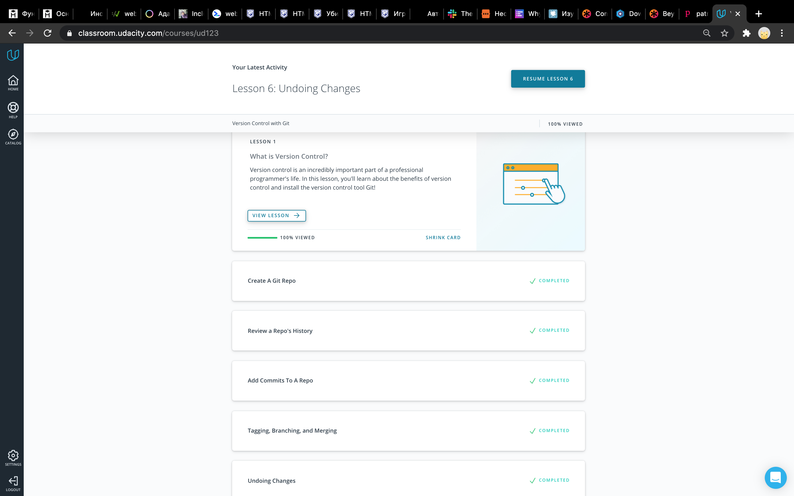
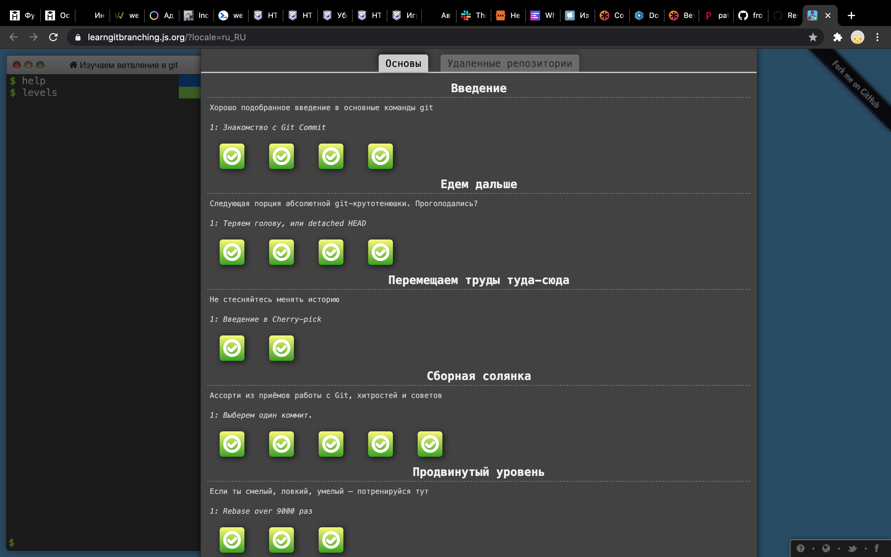

# kottans-frontend
## Repo for [kottans-frontend course tasks](https://github.com/kottans/frontend)

### Curriculum:

**General**
- [x] **0.** [Git basics](https://github.com/kottans/frontend/blob/master/tasks/git-intro.md)
    - Udacity Git course - **[Version Control with Git](https://www.udacity.com/course/version-control-with-git--ud123)**
    - [Learn Git branching interactive course](https://learngitbranching.js.org/) 
- [ ] **1.**  Linux CLI and Networking
- [ ] **2.**  VCS (hello gitty), GitHub and Collaboration

**Front-End Basics**
- [ ] **3.**  [Intro to HTML & CSS](tasks/html-css-intro.md)
- [ ] **4.**  [Responsive Web Design](tasks/html-css-responsive.md)
- [ ] **5.**  [HTML & CSS Practice](tasks/html-css-popup.md)
- [ ] **6.**  [JavaScript Basics](tasks/js-basics.md)
- [ ] **7.**  [Document Object Model](tasks/js-dom.md) - practice

**Advanced Topics**
- [ ] **8.**  [Building a Tiny JS World (pre-OOP)](tasks/js-pre-oop.md) - practice
- [ ] **9.**  [Object oriented JS](tasks/js-oop.md) - practice
- [ ] **10.**  [OOP exercise](tasks/js-post-oop.md) - practice
- [ ] **11.**  [Offline Web Applications](tasks/app-design-offline.md)
- [ ] **12.**  [Memory pair game](tasks/memory-pair-game.md) — real project!
- [ ] **13.**  [Website Performance Optimization](tasks/app-design-performance.md)
- [ ] **14.**  [Friends App](tasks/friends-app.md) - real project!
---

## General

### 0. Git Basics
#### 0.1. [Version Control with Git](https://www.udacity.com/course/version-control-with-git--ud123)
- thing that was new to me
- thing that surprised me
- thing I intend to use in the future

Screenshot

#### 0.2. [Learn Git branching interactive course](https://learngitbranching.js.org/)
- thing that was new to me
- thing that surprised me
- thing I intend to use in the future

Screenshot1

Screenshot2

