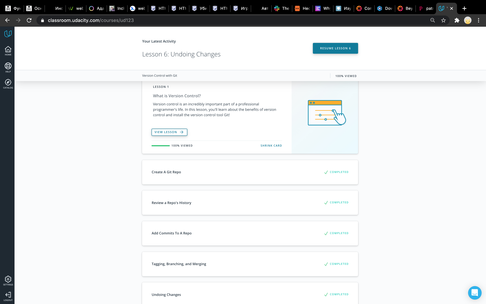
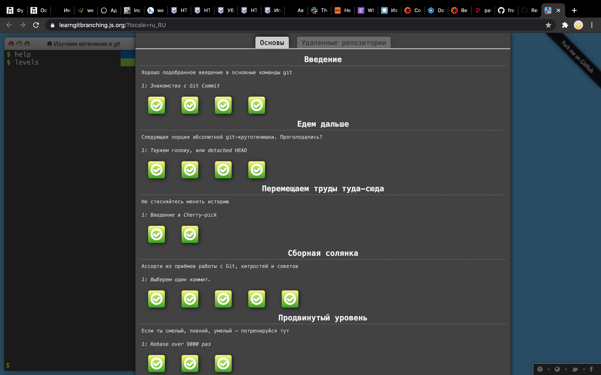
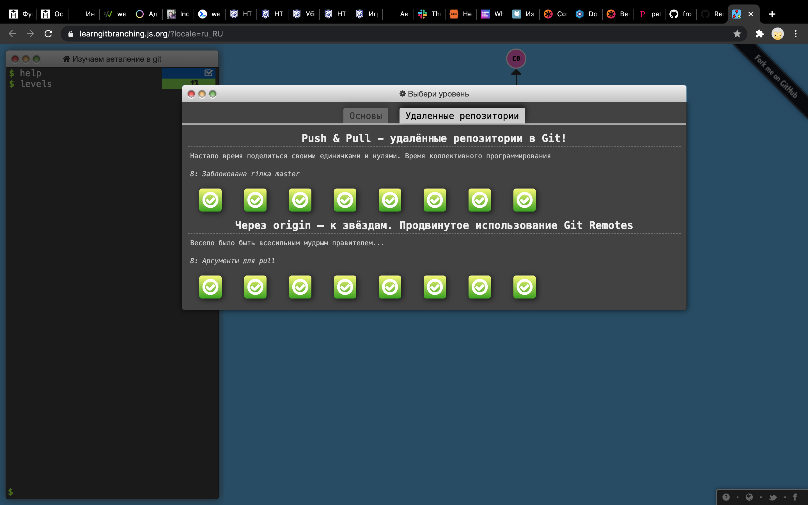

# kottans-frontend :cat:
## Repo for [kottans-frontend course tasks](https://github.com/kottans/frontend) :octocat:

### Curriculum:

**General**
- [x] **0.** [Git basics](https://github.com/kottans/frontend/blob/master/tasks/git-intro.md)
    - Udacity Git course - [Version Control with Git](https://www.udacity.com/course/version-control-with-git--ud123)
    - [Learn Git branching interactive course](https://learngitbranching.js.org/) 
- [ ] **1.**  Linux CLI and Networking
- [ ] **2.**  VCS (hello gitty), GitHub and Collaboration

**Front-End Basics**
- [ ] **3.**  [Intro to HTML & CSS](tasks/html-css-intro.md)
- [ ] **4.**  [Responsive Web Design](tasks/html-css-responsive.md)
- [ ] **5.**  [HTML & CSS Practice](tasks/html-css-popup.md)
- [ ] **6.**  [JavaScript Basics](tasks/js-basics.md)
- [ ] **7.**  [Document Object Model](tasks/js-dom.md) - practice

**Advanced Topics**
- [ ] **8.**  [Building a Tiny JS World (pre-OOP)](tasks/js-pre-oop.md) - practice
- [ ] **9.**  [Object oriented JS](tasks/js-oop.md) - practice
- [ ] **10.**  [OOP exercise](tasks/js-post-oop.md) - practice
- [ ] **11.**  [Offline Web Applications](tasks/app-design-offline.md)
- [ ] **12.**  [Memory pair game](tasks/memory-pair-game.md) — real project!
- [ ] **13.**  [Website Performance Optimization](tasks/app-design-performance.md)
- [ ] **14.**  [Friends App](tasks/friends-app.md) - real project!
---

## General

### 0. Git Basics
#### 0.1. [Version Control with Git](https://www.udacity.com/course/version-control-with-git--ud123)

- This Udacity course was more like updating knowledge to me.
But I also learned about **tagging** and some commands that are going with it (git log --decorate, git describe).
The course also reminded me of the commands **git log -p (--patch)** and **git log -p --stat**
- Thing that surprised me is that I don't know how I lived without **git log --oneline --decorate --graph --all** command before :flushed:
- I'll definitely use this commands every day!

I certainly would recommend the course for all newbies. It's easy for understanding 

Screenshot

#### 0.2. [Learn Git branching interactive course](https://learngitbranching.js.org/)
- I practiced on this course before, but passed only half of the levels. A few months ago it seemed to me much more complex. 
This time I've finished all tasks. But it was still hard for me to pass the last level. I definitely should try to pass it one more time after having some practice.
New for me: difference between rebasing and merging (Rebasing is ok to use when you do not care about the commit history, but the tree readability is important for you. But it's better to use merging if the commit history is very important.
- thing that surprised me is that cherry-picking is not so complex as it seemed to me before
- thing I intend to use in the future: cherry-picking :) 

Screenshot1

Screenshot2

#### Additional:
- added some new git cheatsheets to bookmarks 
- finished markdown tutorial on Github 
- finished short course about Shell on udacity while learning Version Control with Git
---
