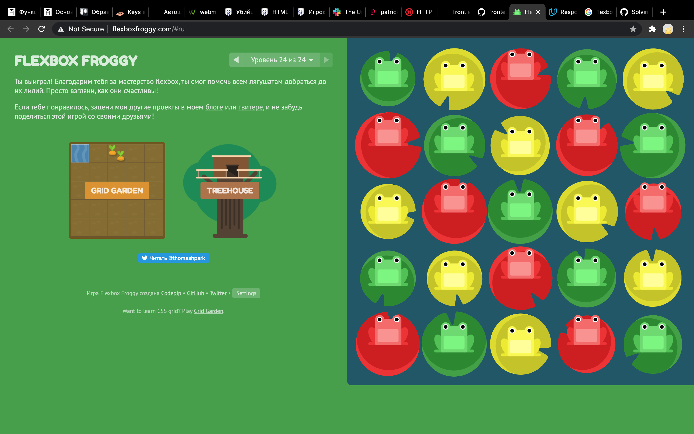
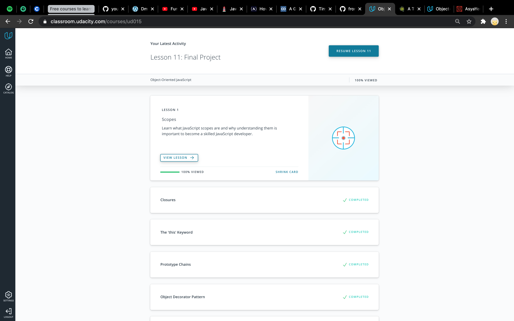

# kottans-frontend :cat:
### Repo for [kottans-frontend course tasks](https://github.com/kottans/frontend) :octocat:
---

## Curriculum:

**General**
- [x] **0.** [Git basics](https://github.com/kottans/frontend/blob/master/tasks/git-intro.md)
    - [Course: Version Control with Git (Udasity)](https://www.udacity.com/course/version-control-with-git--ud123)
    - [Course: Learn Git branching](https://learngitbranching.js.org/)
- [x] **1.** [Linux CLI and Networking](https://github.com/kottans/frontend/blob/master/tasks/linux-cli-http.md)
    - [Course: Linux Survival](https://linuxsurvival.com/linux-tutorial-introduction/)
    - [Article: HTTP: The Protocol Every Web Developer Must Know - Part 1](https://code.tutsplus.com/tutorials/http-the-protocol-every-web-developer-must-know-part-1--net-31177)
    - [Article: HTTP: The Protocol Every Web Developer Must Know - Part 2](https://code.tutsplus.com/tutorials/http-the-protocol-every-web-developer-must-know-part-2--net-31155)
- [x] **2.** [VCS (hello gitty), GitHub and Collaboration](https://github.com/kottans/frontend/blob/master/tasks/git-collaboration.md)
    - [Course: GitHub & Collaboration](https://classroom.udacity.com/courses/ud456)
    - [Course: Learn Git branching (last levels)](https://learngitbranching.js.org/)

**Front-End Basics**
- [x] **3.** [Intro to HTML & CSS](https://github.com/kottans/frontend/blob/master/tasks/html-css-intro.md)
    - [Course: Intro to HTML & CSS (Udasity)](https://www.udacity.com/course/intro-to-html-and-css--ud304)
    - [Course: Learn HTML(Codeacademy)](https://www.codecademy.com/learn/learn-html)
    - [Course: Learn CSS(Codeacademy)](https://www.codecademy.com/learn/learn-css)
- [x] **4.** [Responsive Web Design](https://github.com/kottans/frontend/blob/master/tasks/html-css-responsive.md)
    - [Course: Responsive Web Design Fundamentals](https://www.udacity.com/course/responsive-web-design-fundamentals--ud893)
    - [Game: Flexbox froggy](http://flexboxfroggy.com/)
- [x] **5.** [HTML & CSS **Practice**](https://github.com/kottans/frontend/blob/master/tasks/html-css-popup.md)
- [x] **6.** [JavaScript Basics](https://github.com/kottans/frontend/blob/master/tasks/js-basics.md)
    - [Course: Intro to JS](https://classroom.udacity.com/courses/ud803)
    - FreeCodeCamp exercises
- [x] **7.** [Document Object Model](https://github.com/kottans/frontend/blob/master/tasks/js-dom.md) - practice
    - [Course: JS and the DOM](https://classroom.udacity.com/courses/ud117)
    - FreeCodeCamp exercises

**Advanced Topics**
- [x] **8.** [Building a Tiny JS World (pre-OOP)](https://github.com/kottans/frontend/blob/master/tasks/js-pre-oop.md) - practice
    - [Practice: Tiny JS World](https://github.com/OleksiyRudenko/a-tiny-JS-world)
- [x] **9.** [Object oriented JS](https://github.com/kottans/frontend/blob/master/tasks/js-oop.md) - practice
    - [Course: Object Oriented JS](https://classroom.udacity.com/courses/ud015)
    - [Practice: Reach 7 kyu on codewars](https://www.codewars.com/)
- [ ] **10.** [OOP exercise](https://github.com/kottans/frontend/blob/master/tasks/js-post-oop.md) - practice
- [ ] **11.** [Offline Web Applications](https://github.com/kottans/frontend/blob/master/tasks/app-design-offline.md)
- [ ] **12.** [Memory pair game](https://github.com/kottans/frontend/blob/master/tasks/memory-pair-game.md) — real project!
- [ ] **13.** [Website Performance Optimization](https://github.com/kottans/frontend/blob/master/tasks/app-design-performance.md)
- [ ] **14.** [Friends App](https://github.com/kottans/frontend/blob/master/tasks/friends-app.md) - real project!

---

# Stage 0. Self-Study

## General
---

### 0.0. Git Basics
#### 0.0.1. [Version Control with Git](https://www.udacity.com/course/version-control-with-git--ud123)

- This Udacity course was more like updating knowledge to me.
But I also learned about **tagging** and some commands that are going with it (git log --decorate, git describe).
The course also reminded me of the commands `git log -p (--patch)` and `git log -p --stat`
- Thing that surprised me is that I don't know how I lived without `git log --oneline --decorate --graph --all` command before :flushed:
- I'll definitely use this commands every day!

I certainly would recommend the course for all newbies. It's easy for understanding

<details><summary>Screenshot</summary>
<p>


</p>
</details>

#### 0.0.2. [Learn Git branching interactive course](https://learngitbranching.js.org/)
- I practiced on this course before, but passed only half of the levels. A few months ago it seemed to me much more complex.
This time I've finished all tasks. But it was still hard for me to pass the last level. I definitely should try to pass it one more time after having some practice.
New for me: difference between rebasing and merging (Rebasing is ok to use when you do not care about the commit history, but the tree readability is important for you. But it's better to use merging if the commit history is very important.
- thing that surprised me is that cherry-picking is not so complex as it seemed to me before
- thing I intend to use in the future: cherry-picking :)

<details><summary>Screenshot1</summary>
<p>


</p>
</details>

<details><summary>Screenshot2</summary>
<p>


</p>
</details>

##### Additional:
- added some new git cheatsheets to bookmarks
- finished markdown tutorial on Github
- finished short course about Shell on udacity while learning Version Control with Git

---

### 0.1. Linux CLI, and HTTP

#### 0.1.1 [Linux Survival Course](https://linuxsurvival.com/linux-tutorial-introduction/)

- While I was passing [Course: Version Control with Git (Udasity)](https://www.udacity.com/course/version-control-with-git--ud123) I also finished the [Shell Workshop](https://www.udacity.com/course/shell-workshop--ud206) on Udacity, so some commands were not new for me on this stage.
New info for me: security modes (`r` for reading, `w` for writing, `x` for executing) and `chmod` command for changing modes.
Some more new commands: `finger` - for showing user info; `cat` - for concatenating (adding).
Command `ps aux` for listing processes (`ps aux |grep <someword>` for listing processes with this word) may be also useful.
- Surprised me: managing printer queue from the command line.
- I'm sure I'll use such commands as `ls -l`. And some tips as using * and ? for simplified search.
Maybe I'll use `df` command to watch free disk space.
Commands like `rmdir` for deleting empty dir; `rm -r <dirname>` for deleting dir with such name.
Also, I'm sure I will not manage print queue from the command line :grinning:


<details><summary>Screenshot 1</summary>
<p>


</p>
</details>

<details><summary>Screenshot 2</summary>
<p>


</p>
</details>

<details><summary>Screenshot 3</summary>
<p>


</p>
</details>

<details><summary>Screenshot 4</summary>
<p>


</p>
</details>

#### 0.1.2. [HTTP: The Protocol Every Web Developer Must Know - Part 1](https://code.tutsplus.com/tutorials/http-the-protocol-every-web-developer-must-know-part-1--net-31177)
and
#### 0.1.3. [HTTP: The Protocol Every Web Developer Must Know - Part 2](https://code.tutsplus.com/tutorials/http-the-protocol-every-web-developer-must-know-part-2--net-31155)

- New for me:
Status codes (1xx: Informational Messages, 2xx: Successful, 3xx: Redirection, 4xx: Client Error, 5xx: Server Error).
The request verbs (methods) **GET** for getting an existing resource, **POST** - with data for new resource, **PUT** updating resource, **DELETE** .
Finaly I understood what means S in https :)
It was interesting to read about persistent and parallel connections and caching (Document Expiration part was the most interesting for me).
- It was a little surprise for me how much other info is transferred between the client and the server, in addition to the information that the user requests.
- The article is very rich for new information. So it worth re-reading it in the future for deeper understanding.

---

### 0.2. Git for Team Collaboration

#### 0.2.1. [Course: GitHub & Collaboration](https://classroom.udacity.com/courses/ud456)

- The course was more like a repetition of previously used knowledge about `git remore` commands, `push`, `pull`, `fetch`.
- Now the difference between `pull` and `fetch` seems more clear to me. (`fetch` + `merge` = `pull`)
I learned a lot of new commands for viewing repo history which are useful for collaboration.
- I think I'll use such commands:
  - `git shortlog` for showing all contributors of a repo.
  - `git log --grep=<someword>` search by keyword in the commit messages.
  - `git log --author=<Authorname>` search by author
  - `git show SHA` - search commit by SHA
  - `git remote rename <newRepoName> <oldRepoName>` to rename remote repositories (e.g. origin or upstream)
  - `git rebase -i HEAD~3` rebase last commits into 1 (interactive)
  - `git push -f` - Force Pushing

<details><summary>Screenshot</summary>
<p>


</p>
</details>


#### 0.2.2. [Course: Learn Git branching (last levels)](https://learngitbranching.js.org/)
I had passed it while doing task 0.0.Git Basics.

<details><summary>Screenshot1</summary>
<p>


</p>
</details>

<details><summary>Screenshot2</summary>
<p>


</p>
</details>

---

## Front-End Basics
---

### 0.3. Intro to HTML & CSS

#### 0.3.1. [Course: Intro to HTML & CSS (Udasity)](https://www.udacity.com/course/intro-to-html-and-css--ud304)

It's a useful course for making first steps in HTML and CSS.
There was no new info for me.

<details><summary>Screenshot</summary>
<p>


</p>
</details>

#### 0.3.2. [Course: Learn HTML(Codeacademy)](https://www.codecademy.com/learn/learn-html)
It's a useful course for making first steps in HTML.
New for me:
- tag for inserting video

```
    <video src="myVideo.mp4" width="320" height="240" controls>
    Video not supported
    </video>
```
- tag for inserting audio

```
    <audio autoplay controls>
    <source src="AudioFile.mp3" type="audio/mp3">
    </audio>
```
- Datalist element for making input with the ability to select a proposed variant (like a select input) and ability to enter user's own variant.
```
    <label for="idname">Choose a flavor:</label>
    <input list="datalistid" id="idname" name="idname" />
    <datalist id="datalistid">
        <option value="Chocolate">
        <option value="Coconut">
    </datalist>
```
- tag `<embed>` for embedding media content from an external source

```
    <embed src="download.gif"/>
```
- Validation: matching a pattern (for example pattern which checks that the user provided only numbers, min 14 digits - max 16 digits `pattern="[0-9]{14,16}`; or `[a-zA-Z0-9]+` for letters and numbers)


<details><summary>Screenshot</summary>
<p>


</p>
</details>


#### 0.3.3. [Course: Learn CSS(Codeacademy)](https://www.codecademy.com/learn/learn-css)

Flex and grid properties that were new for me:
- Property `flex:` is short for grow, shrink, basis properties.
- Property `flex-flow:` is for flex-wrap and flex-direction properties in one line.
- `grid-template:` short for row and column sizes. For example `grid-template: 200px 300px / 20% 10% 70%;`.
- `repeat` can be used not only for one value. This line `grid-template-columns: repeat(2, 20px 50px)` is equal to 20px 50px 20px 50px.
- Minmax property should have min and max values in brackets: `grid-template-columns: 100px minmax(100px, 500px) 100px;`.
- Using word `span`. For example `grid-column: 4 / span 2;` means start at column 4 and take 2 columns of space.
- `grid-area:` is short for grid-row-start, grid-column-start, grid-row-end, grid-column-end. For example `grid-area: 2 / 3 / 4 / span 5;`
- `grid-template-areas` for giving a name for areas and maintaining their position. It's like an alternative way of specifying the position.
- `grid-auto-rows and -columns` for maintaining sizes of rows and columns which are not specified before. The first line specifies the first 2 rows and 2 columns, the second line makes all other rows 50px width
```
    grid: repeat(2, 100px) / repeat(2, 150px);
    grid-auto-rows: 50px;
```
- `grid-auto-flow` property specifies the order in which new elements are rendered: rows(default), columns, dense (to fill holes earlier in the grid layout if smaller elements are added)

New transition properties for me:
- `transition-property:` (color, size ...)
- `transition-duration:` (time: s, ms)
- `transition-delay:` (time: s, ms)
- `transition-timing-function:` (ease-in, ease-out, ease-in-out, linear)
- short rule: `transition: color 1.5s linear 0.5s;`

Using new knowledge:
- It would be great to remember some of the properties that were made for making code shorter. This will help me to understand code written by others. But maybe using such shortening can make a code more complex for understanding it from the first sight. So i'm not sure I'll use all of them.
- I'll definitely use such properties for grids as: `grid-template:`, `repeat`, `span`, `grid-area`, `grid-template-areas`


<details><summary>Screenshot</summary>
<p>


</p>
</details>

---

### 0.4. Responsive Web Design

#### 0.4.1. [Course: Responsive Web Design Fundamentals](https://www.udacity.com/course/responsive-web-design-fundamentals--ud893)

New for me:
- Responsive pattrerns (easy to understand with [this examples](https://bradfrost.github.io/this-is-responsive/patterns.html#off-canvas))
  - [Column Drop](https://codepen.io/bradfrost/full/zhCwd)
  - [Mostly Fluid](https://codepen.io/bradfrost/full/Iardn)
  - [Layout Shifter](https://codepen.io/bradfrost/full/LtryA)
  - [Off Canvas](https://codepen.io/grayghostvisuals/full/hemqu)


Also I've found that making tables responsive is a little bit tricky. But I'll use the ideas given in the course:
- to show only short content (jy small screens) if it is possible
- to display table as block
- to make it scrollable (with width: 100% and overflow-x: auto)

<details><summary>Screenshot</summary>
<p>


</p>
</details>


#### 0.4.2. [Game: Flexbox froggy](http://flexboxfroggy.com/)

I've finished the Froggy game and Grid garden game before the course started.

<details><summary>Screenshot</summary>
<p>



</p>
</details>

<details><summary>Screenshot</summary>
<p>


</p>
</details>

---


### 0.5. [HTML & CSS **Practice**](https://github.com/kottans/frontend/blob/master/tasks/html-css-popup.md)

Watch the [Demo](https://asyayeromina.github.io/kottans-task_html-css-popup/)

And check the [Code base](https://github.com/AsyaYeromina/kottans-task_html-css-popup)

Remark for me:
- Don't forget to check code in validator before requesring a review.

---

### 0.6. [JavaScript Basics](https://github.com/kottans/frontend/blob/master/tasks/js-basics.md)

#### 0.6.1. [Intro to JS](https://classroom.udacity.com/courses/ud803)
**New for me :**
This course contains a lot of new info for me, so I decided to make a long workbook.

Here is the LOOOOOONG workbook for me about:

<details>
<summary>Statements, strings, scope and types</summary>
<p>


**Some small things to remember:**
- about strings:
  - special characters for strings: `\"` to prevent reading " as the end of the string;
  - `\n` start a newline in the string;
  - `\t` tab;
  - `\\` backslash;
- `null` means nothing; `undefined` is when the value doesn't exist;
- Difference between variables:
  -  `const` the same as `let` but the value can't be reassigned (read-only). Should be written using UPPERCASE_WITH_UNDERSCORE;
  -  `let` used to declare a variable in any scope - **Global**, **Local**, or **Block**. When using `let`, a variable with the same name can only be declared once. When using `let` inside block it is NOT declared in the global scope.
  -  `var` old one; can rewrite variables with the same name; used to declare a variable in **Global** or **Local** scope; When using `var` inside block it IS declared in the global scope.


- Now I've understood the difference between strongly typed languages and loosely typed. In JS :
  - `0 == false` and `' ' == false` and `"1" == true` return true (because of the **Type Conversion**).
  - If we use `===` (strict equality) the Type Conversion will not work (type will be taken into account and `"1" === 1` will return false).
  - **Implicit type coercion** - is when a number is converting to a string when is concatenating with a string.
- Logical operators `&&` - AND and `||` - OR and `!` - NOT
- **Short-circuiting** (замыкание) when one boolean value is enough to have the result of an expression (for an expressions with `&&` the result will be always false if the 1st value is false; and expression with `||` will always return true if the 1st statement is true);
- 6 falsy values in JS:
  - the Boolean value `false`
  - the `null` type
  - the `undefined` type
  - the number `0`
  - the empty string `""`
  - the odd value `NaN`
- **Ternary operator** (conditional ? (if condition is true) : (if condition is false))
- **Multiple Conditional (Ternary) Operator** (conditional A ? (if condition A is true) : conditional B ? (if condition B is true) : (if condition is false))
- **Switch statements** instead of if...else statements:
```
var varName = "b";
switch (varName) {
    case "a":
    // if varName = "a"
        console.log("You selected a");
    break;
    case "b":
    // if varName = "b"
        console.log("You selected b");
    break;

    // default:   (will return if any of cases match the right variant;)
        // default statement
}
```

</p>
</details>

<details>
<summary>Loops</summary>
<p>

**LOOPS**

- **While loops** :
```
var start = 0; // when to start
while (start < 10) { // when to stop
  console.log(start);
  start = start + 2; // how to get to the next item
}
```
- **Do... While loops**
```
    var ourArray = [];
    var i = 5;
    do {
        ourArray.push(i);
        i++;
    } while (i < 5); // the loop runs "do" before checking the condition
```
- **For loops**
```
for (var i = 0; i < 6; i++) {
  console.log("Printing out i = " + i);
}
```

</p>
</details>

<details>
<summary>Functions</summary>
<p>

**FUNCTIONS**

```
function findAverage(x, y) { // x and y are parameters (variables)
  var answer = (x + y) / 2; // Local variable "answer"
  return answer;
}
var avg = findAverage(5, 9); // 5 and 9 are arguments
```

- **function declaration** are hoisted (function is loaded before the script runs);
    ```
    function nameOfFunction(argument) {
      //some code
    }
    ```
- **function expressions** are not hoisted;
    ```
    var nameOfFunction = function(argument) {
      //some code
    }
    ```
    - *Anonymous function expression*
        ```
        var doSomething = function(y) {
        return y + 1;
        };
        ```
    - *Named function expressions* () are declared and returned with a variable, but also have a name
        ```
        var nameOfFunction = function name(argument) {
        //some code
        }
        nameOfFunction();
        ```
    - *Inline function expressions* is when a function is assigned to a variable
        ```
        <!-- function declaration that takes in two arguments: a function for displaying
        a message, along with a name of a movie -->

        function movies(messageFunction, name) {
            messageFunction(name);
        }

        <!-- call the movies function, pass in the function and name of movie -->

        movies(function displayFavorite(movieName) {
            console.log("My favorite movie is " + movieName);
        }, "Finding Nemo");
        ```
- **Сallback** is a function which is passed into another function.
- **Shadowing** in scope - is when the variable in function/local scope is rewriting the variable in global scope. To avoid this, we should re-declare it inside  the function.

</p>
</details>

<details>
<summary>Arrays</summary>
<p>

**ARRAYS**

- **Arrays' properties and methods**:
    -  *length* property returns the quantity of elements
        ```
        var arrName = ["a", "b", "c"];
        console.log(arrName.length);

        > 3
        ```
    -  *push()* method adds an element to the end of the array and returns the quantity of elements
        ```
        var arrName = ["a", "b", "c"];
        arrName.push("d");

        > 4 \\ arrName = ["a", "b", "c", "d"]
        ```
    -  *pop()* method removes the last element from the array; returns removed element;
        ```
        var arrName = ["a", "b", "c"];
        arrName.pop();

        > "c"
        ```
    -  *splice()* removes and adds elements from anywhere; lets you specify the index of an element; returns the element that have been deleted;
        ```
        var arrName = ["a", "b", "c"];
        arrName.splice(2, 1, "d");

            // position of the item that will be deleted - 2 (third element "c");
            // quantity of elements to be deleted - 1;
            // element(s) to be added on this place ("d" will be added);
            // If 2nd argument is not provided, items will be removed through the end.

        > "c" // returns deleted item
        ```
    - *slice()* copies a given number of elements to a new array (first param = start index(included), second param = last index(excluded), without params - copy all elements to new array)
        ```
        let arr = ['a1', 'a2', 'a3', 'a4', 'a5'];
        let newArr = arr.slice(1, 3);
            // newArr equals ['a2', 'a3'];
            // arr still equals ['a1', 'a2', 'a3', 'a4', 'a5']
        ```
    - *reverse()* reverses elements in array;
    - *sort()* sorts according to callback function
        ```
        function ascendingOrder(arr) {
            return arr.sort(function(a, b) {
                return a - b;
            });
        }
        ascendingOrder([1, 5, 2, 3, 4]);
        // Returns [1, 2, 3, 4, 5]

        ```
    - *shift()* removes first element;
    - *unshift()* adds element to the beginning of the array;
    - *join()* converts strings into 1 string; converts an array to a string;
    - *spread operator ...* copies
        ```
        let thisArray = [true, true, undefined, false, null];
        let thatArray = [...thisArray];
        ```
    - *Object.keys()* generates an array with all the keys of the object;

  - **Array loops**
    ```
    var arrName = ["a", "b", "c"];

        // the variable `i` is used to step through each element in the array

    for (var i = 0; i < arrName.length; i++) {
    arrName[i] += " string";
    }
        // Now the array is ["a string", "b string", "c string"]
    ```
  - **ForEach loop** method
    ```
    var words = ["cat", "in", "hat"];
    words.forEach(function(element, index, array) {
        console.log("Word " + index + " in " + array.toString() + " is " + element);
    });
    ```
  - **Map()** method. Returns new array.
    ```
    var arrName = ["a", "b", "c"];
    var newArrName = arrName.map(function(element) {
        element += " string";
        return element;
    });
        // the arrName stays the same ["a", "b", "c"]
        // but newArrName is ["a string", "b string", "c string"]
    ```

  - **Filter()** method. Returns new array. Can get properties like `currentElement, index, array`
    ```
    ```
  - **Reduce()** method. Returns new array. Can get properties like `resultOfCallback, current, index, array`. May also have `initialValue` as a property.
    ```
    var arr = [1, 2, 3, 4, 5]

        // runs function for each element
        // returns result and puts to the first prop.
    var result = arr.reduce(function(result, current) {
        return result + current;
        // a callback function
    }, 0);
    // 0 is an initialValue

    alert( result ); // 15
    ```
  - **reduceRight()** method works the same but starts from the end of the array and goes to the beginning.

- **Array in array**. You can access to the array of the array with index:
    ```
    var array[["a", "b", "c"], ["a1", "b1", "c1"], [["a21", "a22"], "b2", "b3"]]
    array[2][0][1]; // will return "a22"
    ```

    You can loop through the arrays:
    ```
    var arrOfArr = [
        ["a", "b", "c"],
        ["a1", "b1", "c1"],
        ["a2", "b2", "b3"]];

    for (var row = 0; row < arrOfArr.length; row++) {
    console.log(arrOfArr[row]);
    }
    //prints 3 arrows
    ```
    Or you can loop through a loop of each array in array
    ```
    var arrOfArr = [
        ["a", "b", "c"],
        ["a1", "b1", "c1"],
        ["a2", "b2", "b3"]];

    for (var row = 0; row < arrOfArr.length; row++) {

        for (var column = 0; column < arrOfArr[row].length; column++) {
            console.log(arrOfArr[row][column]);
        }
    };
    //prints each element
    ```

</p>
</details>

<details>
<summary>Objects</summary>
<p>

**OBJECTS**

    ```
    var objectName = {
    property1: "value",
    property2: false,
    methodName: function() {
        if (objectName.property2 === true) {
        return "string";
        } else {
        objectName.property2 = true;
        return "other string";
        }
    }
    };
    ```

To return the value from an object one can use this 2 ways which are equivalent:
`objectName["property"] ` or `objectName.property` (dot notation or brackets notation)
To return the method use `objectName.methodName()`.
Don't use numbers as the first item in property name of an object.
Don't use spaces and hyphens (-) in prop.names. Use cammelCase.
Better not to use " " in prop.names.

**Nested objects:**
To access the property value of an object nested in an object use dot notation or brackets notation (for example `arrayName.)
Use `hasOwnProperty(propname)` method to check if the property exists (returns boolean).

</p>
</details>


Surprise for me:
- I thought that things like scope is much more complicated for understanding.
- Thought that functions would be easy to understand.
- JSON is just JS object notation


<details><summary>Screenshot</summary>
<p>


</p>
</details>


#### 0.6.2. Exercises on freecodecamp.org

- [Basic JavaScript](https://learn.freecodecamp.org/javascript-algorithms-and-data-structures/basic-javascript/)
- [ES6 Challenges](https://learn.freecodecamp.org/javascript-algorithms-and-data-structures/es6/) (19 exercises)
- [Basic Data Structures](https://learn.freecodecamp.org/javascript-algorithms-and-data-structures/basic-data-structures/)
- [Basic Algorithm Scripting](https://learn.freecodecamp.org/javascript-algorithms-and-data-structures/basic-algorithm-scripting/)
- [Functional Programming](https://learn.freecodecamp.org/javascript-algorithms-and-data-structures/functional-programming/)
- [Algorithm Scripting Challenges](https://learn.freecodecamp.org/javascript-algorithms-and-data-structures/intermediate-algorithm-scripting) (11 exercises)


New for me from this courses:

- `Math.Random()`
- `parseInt()`  - `parseInt("11111")` - converts string to number - 11111; `parseInt("11", 2)` - 2 is radix = number from 2 to 36 which specifies the base of the number in the string. For example 2 means binary numeral system. So this will return number 3.
- `"use strict"` enables Strict Mode, which catches common coding mistakes and "unsafe" actions;
- `Object.freeze()` function prevents objects and arrays from data mutation (reassigning, deleting, adding new data will be ignored);
- **The most difficult methods for me were map(), filter(), reduce()**
- **Arrow function** syntax:
    ```
    const myFunc = () => {
    const myVar = "value";
    return myVar;
    }
    ```
    When there is no function body, it's ok to use one-line statements:
    ```
    const myFunc = () => "value"; //returns value by default.
    ```
- **Default parameters** for functions
    ```
    const greeting = (name = "Anonymous") => "Hello " + name;
    ```
- The **rest parameter** allows you to create functions that take a variable number of arguments
    ```
    function howMany(...args) { // can receive several arguments;
        args.length;
    }
    ```
- **Destructuring assignment** for assigning values taken from an object.
    ```
    const user = { name: 'John Doe', age: 34 };
    const { name, age } = user;
    // name = 'John Doe', age = 34
    //
    // or use new variable names :
    // const { name: userName, age: userAge } = user;
    // userName = 'John Doe', userAge = 34
    ```
- **Destructuring & sending the object into the function's parameter**
    ```
    const profileUpdate = ({ propertyA, propertyB, propertyC, propertyD }) => {
        /* do something with these fields */
    }
    ```
- **Template literals**
    ```
    const person = {
    name: "Zodiac Hasbro",
    age: 56
    };

    // Template literal with multi-line and string interpolation
    const greeting = `Hello, my name is ${person.name}!
    I am ${person.age} years old.`;
    // use `` instead of '' or "" !;
    ```


<details><summary>Screenshot</summary>
<p>


</p>
</details>

---

### 0.7. [Document Object Model](https://github.com/kottans/frontend/blob/master/tasks/js-dom.md) - practice

#### 0.7.1 [Course: JS and the DOM](https://classroom.udacity.com/courses/ud117)

**New for me**
All this stuff with nodes and tokens which are turning into DOM elements was new for me.
Some new methods: `.getElementById()`, `.getElementsByClassName()`, `.getElementsByTagName()`, `.querySelector()`, `.querySelectorAll()`.
- Some new properties: `.innerHTML`, `.textContent` (everything is just a text), `.innerHTML` (renders everything as a HTML (tags inside text become HTML tags)), `.innerText`(returns the text as it would be seen visually, after CSS influenced the text).
- Creating elements methods: `.createElement()`, `.appendChild()` (adds element as the last child of the parent element), `.createTextNode()` (creates text which can be added to an element), `.insertAdjacentHTML(position for pasting, text)`, `.removeChild()`, `.remove()`, `.firstElementChild`, `.parentElement`(element.parentElement.removeChild(element)).
- Props and methods for styling: `.style.<property>` (for changing 1 property), `.style.cssText` (can change different props at one time, can overwrite anything that's already in the .style attribute), `.setAttribute()`, `.className`, `.classList` (properties: `.add()`, `.remove()`, `.toggle()`, `.contains()`).

**Browser events**
Browsers have `monitorEvents()` function which is monitoring for clicks, dblclicks, scrolling, resizeing, an a lot of more events.
`unmonitorEvents()` function turns off the announcing of events for the targeted element

IventTarget methods : `.addEventListener()`, `.removeEventListener()`, `.preventDefault()`

`addEventListener('DOMContentLoaded', function () {})` starts listen events when the DOM is ready. `DOMContentLoaded` Works faster than `.onload`

`createDocumentFragment()` - Creates a virtual DocumentFragment into which DOM nodes can be added


<details><summary>Screenshot</summary>
<p>


</p>
</details>


#### 0.7.2 Practice

Tasks with smallest multiple and summ of all primes were the most difficult.
I should definitely return to them later.

<details><summary>Screenshot</summary>
<p>


</p>
</details>


#### 0.7.3 Practice

Watch the [Demo](https://asyayeromina.github.io/Kottans_DOM_task/)

And check the [Code base](https://github.com/AsyaYeromina/Kottans_DOM_task)

---

### 0.8 [Building a Tiny JS World (pre-OOP)](https://github.com/kottans/frontend/blob/master/tasks/js-pre-oop.md) - practice


Watch the [Demo](https://asyayeromina.github.io/a-tiny-JS-world/)

And check the [Code base](https://github.com/AsyaYeromina/a-tiny-JS-world)

---

### 0.9 [Object oriented JS](https://github.com/kottans/frontend/blob/master/tasks/js-oop.md) - practice

#### 0.9.1 [Course: Object Oriented JS](https://classroom.udacity.com/courses/ud015)

This course was to complicated. Some simple thingth were described in complicated manner. So I could just grasp the basic idea.
After that I also finished [this course on Udacity](https://classroom.udacity.com/courses/ud711), and things became more clear to me.
Although all material was new for me, it was easy to understand such things as `this`, `constructor functions`, `closure` and `prototype chains`.

The surprise for me was that I used closure before, but never thought that it was closure.

Looking forward to use constructor functions in my next task from Kottans.


<details><summary>Screenshot</summary>
<p>



</p>
</details>

#### 0.9.2 [Practice: Reach 7 kyu on codewars](https://www.codewars.com/)


<details><summary>Screenshot</summary>
<p>


</p>
</details>
